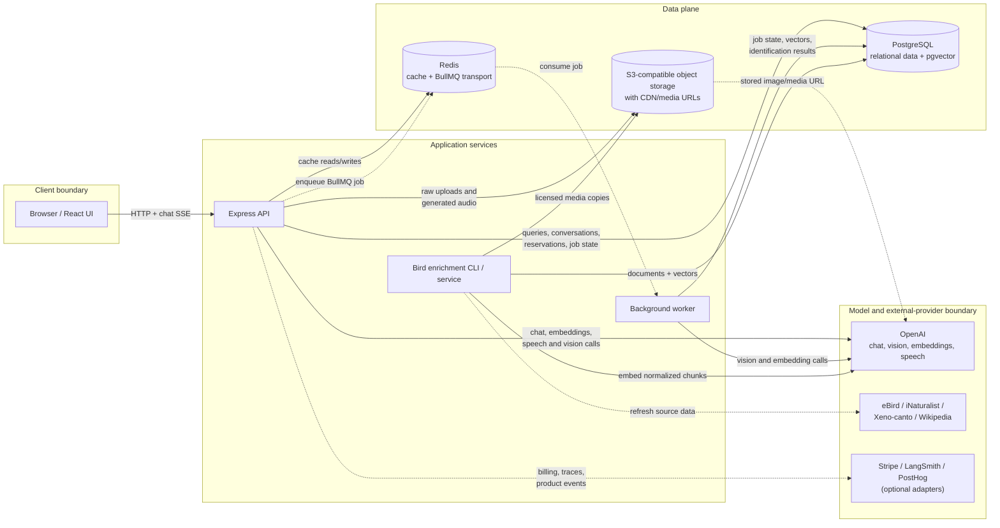

# Birdwatching AI — system portfolio case study

> Canonical system overview for the
> [API](https://github.com/jsanchez556/birdwatching-ai-api) and
> [UI](https://github.com/jsanchez556/birdwatching-ai-ui) repositories.
> Evidence was reviewed at API revision `35dd6b4` and UI revision `e4bf473`
> on 2026-07-29.

## Portfolio summary

Birdwatching AI helps Costa Rica visitors and birding travelers move from an
open-ended question or field photo to grounded species guidance, tour
selection, and a durable reservation. The system combines a React product
shell, an Express API, PostgreSQL/pgvector retrieval and transactions,
Redis/BullMQ background work, object storage, and model-provider calls while
keeping AI output behind validation, uncertainty, and failure-handling
boundaries.

The intended outcome is a shorter path from “What bird is this?” or “What can I
see near Monteverde?” to evidence-backed guidance and, for authenticated
customers, a booking confirmation that comes from database state rather than
model prose.

## What the repositories establish about contribution

The repositories contain the application-specific orchestration, contracts,
tests, and documentation listed below. Git history is concentrated under one
email address, but the repositories do not contain a verified identity or a
signed contribution breakdown. This case study therefore does **not** claim
sole personal authorship; a candidate should explain their exact role during an
interview or add a verified contribution statement.

| Scope visible in the repositories | Boundary not claimed as original work |
|---|---|
| Product-shell and chat orchestration; API adapters; guarded local conversation state; multimodal job polling; booking and reservation UI | React, Vite, browser APIs, and framework behavior |
| RAG assembly, hybrid retrieval, tool planning/execution, prompt/schema validation, queue workers, persistence, telemetry, and evaluation harnesses | OpenAI models/APIs, PostgreSQL, pgvector, Redis, BullMQ, AWS SDK/S3-compatible storage, LangSmith, PostHog, and Stripe |
| Domain normalization and application tests around bird knowledge, tours, reservation rules, and failure states | Seeded tour data and external bird/media data sourced through eBird, iNaturalist, Xeno-canto, and Wikipedia-compatible clients |
| Provider-neutral billing domain and an admin payment simulator | Simulated billing events are QA data, not customer transactions; the synthetic scorer self-test validates scorers, not model quality |

## Architecture

Solid arrows are synchronous request/data paths; dashed arrows are asynchronous
or optional integrations.

Implementation evidence:
[UI API boundary](https://github.com/jsanchez556/birdwatching-ai-ui/tree/main/src/api),
[API composition](../src/api/app.js),
[API/worker separation](./architecture.md),
[PostgreSQL + pgvector migration](../src/db/migrations/001_schema.sql),
[BullMQ manager](../src/queues/queue.manager.js),
[worker manager](../src/workers/worker.manager.js),
[S3-compatible storage](../src/storage/s3Bucket.service.js), and
[provider clients](../src/ingestion/clients).

## End-to-end AI traces

### 1. Grounded bird question — `Tested`, not yet visually demonstrated

**Input:** a user asks, for example, “Where can I see resplendent quetzals near
Monteverde?”

1. The UI trims and submits the message through the chat adapter, opens an SSE
   stream, progressively renders chunks, and supports cancellation.
2. The API validates the request, applies role/topic guardrails, loads
   conversation context, and asks the RAG service for grounding.
3. RAG normalizes the query, checks Redis, embeds on a miss, retrieves ranked
   PostgreSQL/pgvector chunks, applies hybrid ranking and per-document limits,
   and injects compact context after the system message.
4. The chat service streams the model response, buffers output for guardrail
   checks, records usage best-effort, persists the completed exchange, and
   returns sources plus safe bird-match metadata.
5. Redis, retrieval, or persistence failures have explicit fallbacks. In
   particular, retrieval failure is fail-open: chat continues without RAG
   context. That preserves availability but means “grounded” is not guaranteed
   for a degraded request, so the absence of sources must remain visible.

**User-visible output:** streamed assistant text and, when returned, bird media
cards backed by retrieval metadata.

Evidence:
[UI chat hook](https://github.com/jsanchez556/birdwatching-ai-ui/blob/main/src/hooks/useChat.js),
[chat API adapter](https://github.com/jsanchez556/birdwatching-ai-ui/blob/main/src/api/chatApi.js),
[chat service](../src/services/chat.service.js),
[RAG service](../src/services/rag.service.js),
[retrieval service](../src/ai/services/retrieval.service.js),
[vector repository](../src/db/repositories/vector/vector.repository.js),
[RAG tests](../__tests__/rag.service.test.js),
[chat tests](../__tests__/chat.service.test.js), and
[UI chat tests](https://github.com/jsanchez556/birdwatching-ai-ui/blob/main/src/hooks/__tests__/useChat.test.jsx).

### 2. Multimodal bird identification — `Tested`, demo artifact missing

**Input:** an authenticated user supplies a JPEG, PNG, WebP, or GIF upload, or a
validated image URL.

1. The UI rejects empty, oversized, HEIC, and unsupported inputs before upload.
2. `POST /birds/identify` authenticates, validates one image source, checks
   quota, stores raw uploads in object storage, creates durable PostgreSQL job
   state, and enqueues only the stored image URL and safe metadata.
3. A BullMQ worker marks the job active and runs image analysis plus structured
   visual candidate generation. Candidate shape and visible evidence are
   validated before RAG enrichment.
4. Candidate names and traits form a compact retrieval query. Bird-profile
   evidence is merged and reranked; low-confidence results become
   `uncertain` below `0.55` and `unknown` below `0.40`. RAG failure returns a
   cautious visual result instead of inventing retrieved support.
5. BullMQ uses three attempts with exponential backoff by default. Exhausted,
   malformed, enqueue-failed, and stalled jobs enter safe failure paths; the UI
   polls until completed, failed, not found, or its polling limit is reached.

**User-visible output:** job status followed by the best match, submitted-photo
comparison, alternatives, visible evidence, confidence, and uncertainty notes.

Evidence:
[UI identification hook](https://github.com/jsanchez556/birdwatching-ai-ui/blob/main/src/hooks/useBirdIdentification.js),
[UI modal](https://github.com/jsanchez556/birdwatching-ai-ui/blob/main/src/components/BirdIdentificationModal.jsx),
[job service](../src/services/birdIdentificationJob.service.js),
[worker](../src/workers/birdIdentification.worker.js),
[identification service](../src/services/birdIdentification.service.js),
[structured schema](../src/ai/schemas/birdIdentification.schema.js),
[service tests](../__tests__/birdIdentification.service.test.js),
[worker tests](../__tests__/workers/birdIdentification.worker.test.js), and
[UI polling tests](https://github.com/jsanchez556/birdwatching-ai-ui/blob/main/src/hooks/__tests__/useBirdIdentification.test.jsx).

### 3. Transactional tour booking — `Tested`, not a live transaction claim

**Input:** an authenticated customer selects a tour or cart entry, supplies
customer and itinerary context, chooses participants/transportation, and
explicitly confirms.

1. The UI creates an ephemeral reservation chat entry rather than persisting
   pre-confirmation data as a durable reservation. Form validation blocks an
   empty name, invalid email, or invalid date range.
2. The API carries customer and recent assistant metadata into the planner.
   Planner rules require a resolved tour and participant count, preserve
   transportation state, and require an explicit confirmation turn.
3. Tool schemas and handlers stay registered as a matched set. Search,
   availability, transportation, and pricing run in order; permanent
   user-correctable failures are not retried, while bounded retries apply to
   transient tool failures.
4. Tour selection uses exact normalized identifiers/names/locations and stops
   on ambiguity or mismatch. Reservation input is validated before the service
   calls a PostgreSQL function, where availability and creation execute inside
   a transaction with row locking.
5. The model cannot create a confirmation by prose alone. The UI renders a
   confirmed reservation card only from successful structured reservation
   metadata, with a conservative text fallback for older stored messages.

**User-visible output:** guided selection controls, calculated totals, and a
confirmation card containing the database-issued confirmation code.

Evidence:
[reservation entry](https://github.com/jsanchez556/birdwatching-ai-ui/blob/main/src/utils/reservationEntry.js),
[planner/orchestrator](../src/ai/orchestrators/agent.orchestrator.js),
[reservation tool](../src/ai/tools/createReservation.tool.js),
[reservation service](../src/services/reservation.service.js),
[transaction migration](../src/db/migrations/003_functions.sql),
[planning tests](../__tests__/agentPlanningOrchestration.test.js),
[reservation tests](../__tests__/reservation.service.test.js), and
[confirmation UI tests](https://github.com/jsanchez556/birdwatching-ai-ui/blob/main/src/components/__tests__/ChatMessages.test.jsx).

## Consequential AI engineering decisions

| Decision | Why it matters | Tradeoff / failure behavior | Evidence |
|---|---|---|---|
| Offline ingestion; runtime retrieval only | Removes document parsing, external fetches, and vector writes from chat latency | Knowledge freshness depends on a separate enrichment run; empty/unavailable pgvector degrades to ungrounded chat | [Architecture](./architecture.md), [historical design change](./development_prompts/13_ingest-pipeline), [ingestion service](../src/services/documentIngestion.service.js) |
| Hybrid, metadata-aware retrieval with bounded chunks per document | Reduces domination by one long document and supports bird/location filters | More candidates improve recall but add query/reranking work; the advanced profile is feature-flagged | [RAG service](../src/services/rag.service.js), [retrieval tests](../__tests__/retrieval.service.test.js) |
| Structured tools plus business validation | Treats model tool output as untrusted input and prevents prose from becoming a reservation | More deterministic branching and clarification turns; invalid/mismatched tours fail instead of being “helpfully” rewritten | [tool registry](../src/ai/tools/index.js), [orchestration tests](../__tests__/agentPlanningOrchestration.test.js), [reservation tests](../__tests__/reservation.service.test.js) |
| Vision candidates first, RAG verification second | Keeps visual claims tied to image evidence while using the knowledge base to verify/rerank | A weak image can remain uncertain even with a plausible retrieved bird profile | [identification service](../src/services/birdIdentification.service.js), [prompt guidance](./prompting.md), [tests](../__tests__/birdIdentification.service.test.js) |
| Dual conversation continuity | PostgreSQL is durable truth; guarded, user-scoped `localStorage` makes reloads responsive | Local cache can be stale and is intentionally limited to non-sensitive rendered state | [backend memory](./memory.md), [UI state utility](https://github.com/jsanchez556/birdwatching-ai-ui/blob/main/src/utils/chatConversationState.js) |
| Bounded retry and asynchronous isolation | Long-running identification and ingestion do not hold an HTTP request open | Requires Redis/worker availability and polling; stale jobs are explicitly failed | [job options](../src/jobs/jobOptions.js), [job service tests](../__tests__/birdIdentificationJob.service.test.js), [queue tests](../__tests__/queues/queue.manager.test.js) |
| Cache only when context is safe to reuse | Exact, semantic, embedding, and retrieval caches can avoid provider/database work | Authenticated, tool, reservation, and conversation-specific responses bypass reuse; Redis failure falls back to source systems | [response cache](../src/cache/responseCache.js), [RAG tests](../__tests__/rag.service.test.js) |
| Observability without raw prompt/customer content | Traces latency, tokens, tools, retrieval, and errors while reducing leakage risk | Local telemetry is process-scoped; no checked-in production aggregate proves outcomes | [observability design](./architecture.md#ai-observability), [telemetry](../src/monitoring/aiTelemetry.js) |
| Fail-closed portfolio evaluation provenance | Prevents synthetic labels from being presented as model/RAG performance | There is currently no publishable real-pipeline quality baseline | [testing provenance](./testing.md), [unavailable baseline](../src/evaluations/datasets/ai-eval-baseline.json), [regression tests](../__tests__/ai/portfolioRegression.test.js) |

### Superseded or rejected approaches

- Request-time ingestion was explicitly separated from chat so retrieval reads
  already-ingested vectors rather than doing external fetches, chunking, or
  embedding writes during a user request
  ([design record](./development_prompts/13_ingest-pipeline)).
- A prior synthetic portfolio baseline was retired. The remaining `0.9839`
  self-test score is intentionally labeled scorer validation, while the
  real-pipeline baseline fails closed as unavailable
  ([testing notes](./testing.md),
  [self-test baseline](../src/evaluations/datasets/scorer-self-test-baseline.json)).
- Fuzzy tour guessing is rejected in favor of exact normalized matching and
  explicit ambiguity handling because a superficially helpful match can book
  the wrong inventory
  ([repository rules](../AGENTS.md),
  [reservation mismatch test](../__tests__/reservation.service.test.js)).

## Results and evidence status

No production traffic, customer outcome, or reviewed staging benchmark artifact
is checked in. “Tested” below means deterministic automated behavior, not a
production KPI.

| Result | Status | Value / unit | Dataset / sample | Environment | Method and revision |
|---|---|---:|---|---|---|
| End-to-end and model latency | `Not yet measured` | — | `n=0` publishable traces | No captured environment | Capture API root and child LLM spans for at least 100 scripted staging turns; report median/p95 separately. Instrumentation: [AI tracing](../src/tracing/aiTracing.middleware.js). API `35dd6b4` |
| Real-pipeline retrieval quality | `Not yet measured` | — | `n=0`; 100-case dataset exists but has no reviewed outputs | No captured environment | Run `npm run ai:evals -- --results <artifact>` with reviewed retrieval IDs/content and provenance. [Baseline](../src/evaluations/datasets/ai-eval-baseline.json). API `35dd6b4` |
| Deterministic scorer behavior | `Tested` | `0.9839` score; `0.9796` retrieval score | `n=100` synthetic label-derived cases | Local deterministic scorer self-test; not model/RAG execution | `npm run ai:evals:self-test`; [artifact](../src/evaluations/datasets/scorer-self-test-baseline.json). Baseline date unknown; reviewed 2026-07-29 |
| Tool / booking success rate | `Not yet measured` | — | `n=0` representative transactions | No captured environment | Script a seeded, isolated PostgreSQL run across success, ambiguity, sold-out, conflict, and provider-failure cases; report successful durable confirmations / valid attempts. Existing [behavior tests](../__tests__/agentPlanningOrchestration.test.js) are not a rate |
| Estimated cost per request | `Not yet measured` | — | `n=0` publishable usage events | No captured environment | Run at least 100 staging traces and aggregate `usage_logs` by workflow/model, reporting mean and p95 estimated USD with pricing revision. [Usage service](../src/services/usage.service.js) |
| Cache hit rate / benefit | `Not yet measured` | — | `n=0` publishable cache traces | No captured environment | Replay a versioned cold/warm query set; report exact/semantic/retrieval hit rate, latency delta, avoided calls, and estimated USD. [Cache instrumentation](./architecture.md#ai-observability) |
| Abstention/calibration quality | `Not yet measured` | — | `n=0` human-reviewed image set | No captured environment | Build a licensed, difficulty-stratified image set; compare `identified / uncertain / unknown` with labels and report coverage, accuracy, and selective risk. Threshold branches are [tested](../__tests__/birdIdentification.service.test.js), but they do not establish calibration |

### Validation snapshot

Run locally on 2026-07-29 against API `35dd6b4` and UI `e4bf473`:

| Command | Result |
|---|---|
| API `npm test -- --runInBand` | 113 suites, 782 tests passed |
| UI `npm test -- --runInBand` | 38 suites, 250 tests passed |
| API `npm run build` | Passed |
| UI `npm run build` | Passed; Vite reported a 564.51 kB main JavaScript chunk (174.46 kB gzip) and its standard greater-than-500 kB chunk warning |
| API `npm run ai:evals:self-test` | 100 synthetic scorer cases passed; still not model/RAG quality evidence |

## Limitations and next milestone

Current limitations:

- There is no verified live demo URL, AI-workflow recording, or checked-in
  retrieval/identification/booking screenshot sequence.
- No reviewed real-pipeline evaluation artifact exists; the 100-case golden
  dataset has unknown authoring/reviewer provenance and synthetic traffic
  distribution.
- Runtime telemetry exists, but publishable latency, cost, cache, booking, and
  uncertainty aggregates do not.
- RAG fails open when retrieval is unavailable. Availability is preserved, but
  callers must not assume every response is grounded.
- Multimodal identification depends on object storage, Redis, a worker, model
  access, and remotely fetchable media; unit/integration tests mock several of
  these boundaries.
- Local conversation caching improves reload behavior but is not a substitute
  for cross-device state or a durable offline-first design.
- The current UI build has a single main JavaScript chunk above Vite's 500 kB
  warning threshold; route/component code-splitting has not been benchmarked.

**Next reliability milestone:** run the 100-case portfolio dataset through a
staging deployment with reviewed real outputs and complete provenance. The
milestone is complete when all 100 cases have explicit retrieval status, every
applicable tool outcome is recorded, zero outputs are constructed from labels,
and `npm run ai:evals -- --results <artifact>` passes the checked-in thresholds
while publishing median/p95 end-to-end latency and mean estimated cost.

## Demo status and local walkthrough

**Demo status (2026-07-29):** no verified live URL or recorded AI-workflow
walkthrough is present. The UI repository contains an
[admin dashboard screenshot](https://github.com/jsanchez556/birdwatching-ai-ui/blob/main/docs/images/admin-dashboard.png),
but it is not evidence of retrieval, identification, or booking behavior.

To reproduce the product locally:

1. Install Node.js 22+, PostgreSQL with pgvector, and Redis. Clone the
   [API](https://github.com/jsanchez556/birdwatching-ai-api) and
   [UI](https://github.com/jsanchez556/birdwatching-ai-ui) repositories beside
   each other.
2. In the API repository, run `npm install`, configure `OPENAI_API_KEY`,
   `DATABASE_URL`, `JWT_SECRET`, and `REDIS_URL`, then apply the migrations
   listed in the [API README](../README.md#local-setup).
3. Configure S3-compatible storage and a reachable media URL before testing raw
   photo uploads. Run `npm run enrich -- birds` to create the pgvector bird
   index, then `npm run dev` to start the API and worker.
4. In the UI repository, run `npm install`, set
   `VITE_API_PROXY_TARGET=http://localhost:3001`, and run `npm run dev`. Open
   `http://localhost:5173`.
5. Walk through: (a) ask a bird/location question and inspect returned bird
   evidence; (b) sign in, upload a bird photo, and observe queued status through
   the uncertainty result; (c) select a tour, provide customer context, choose
   participants/transportation, explicitly confirm, and verify the returned
   confirmation code.

**Recording placeholder:** add a two-to-five-minute walkthrough plus annotated
retrieval, identification, and booking captures under `docs/images/` or
`docs/media/`, then link the immutable artifact and capture revision here.

## Claim-to-evidence map

| Portfolio claim | Direct evidence | Evidence class / gap |
|---|---|---|
| Chat uses pgvector-backed grounding and Redis retrieval caching | [RAG service](../src/services/rag.service.js), [vector repository](../src/db/repositories/vector/vector.repository.js), [tests](../__tests__/rag.service.test.js) | Implemented and tested; quality/latency unmeasured |
| Identification is asynchronous, multimodal, and uncertainty-aware | [job service](../src/services/birdIdentificationJob.service.js), [worker](../src/workers/birdIdentification.worker.js), [identification tests](../__tests__/birdIdentification.service.test.js) | Implemented and tested with mocked boundaries; no licensed benchmark/demo |
| Booking requires validated structured state and a DB transaction | [orchestrator](../src/ai/orchestrators/agent.orchestrator.js), [reservation service](../src/services/reservation.service.js), [transaction](../src/db/migrations/003_functions.sql), [tests](../__tests__/reservation.service.test.js) | Implemented and tested; no production success rate |
| Conversation state survives reloads without making the browser authoritative | [backend memory](./memory.md), [UI state utility](https://github.com/jsanchez556/birdwatching-ai-ui/blob/main/src/utils/chatConversationState.js), [UI tests](https://github.com/jsanchez556/birdwatching-ai-ui/blob/main/src/hooks/__tests__/useChat.test.jsx) | Implemented and tested |
| Queue failures, retries, final failure, and stalled jobs have bounded behavior | [job defaults](../src/jobs/jobOptions.js), [job tests](../__tests__/birdIdentificationJob.service.test.js), [worker tests](../__tests__/workers/birdIdentification.worker.test.js) | Implemented and tested; distributed load not benchmarked |
| AI quality reporting rejects synthetic evidence as portfolio quality | [portfolio runner](../src/evaluations/runners/portfolioRegression.runner.js), [tests](../__tests__/ai/portfolioRegression.test.js), [baseline](../src/evaluations/datasets/ai-eval-baseline.json) | Implemented and tested; real baseline missing |
| Billing lifecycle testing can be simulated without claiming revenue | [simulator](../src/services/billing/paymentSimulator.service.js), [tests](../__tests__/billingPaymentSimulator.service.test.js) | Explicitly simulated |
| Operational dashboard exists | [UI screenshot](https://github.com/jsanchez556/birdwatching-ai-ui/blob/main/docs/images/admin-dashboard.png), [dashboard tests](https://github.com/jsanchez556/birdwatching-ai-ui/blob/main/src/pages/__tests__/AdminDashboard.test.jsx) | Visual evidence plus tests; screenshot is not live telemetry proof |
